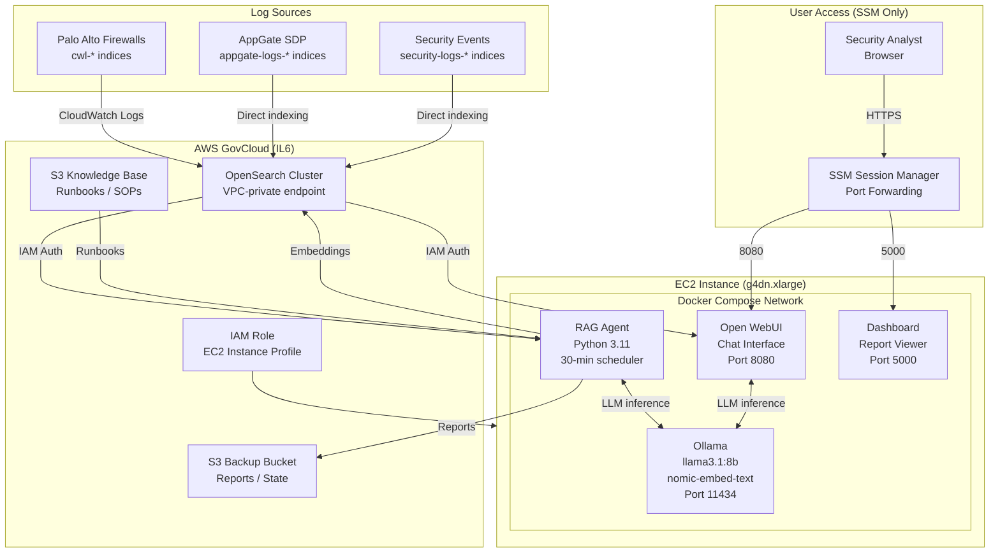
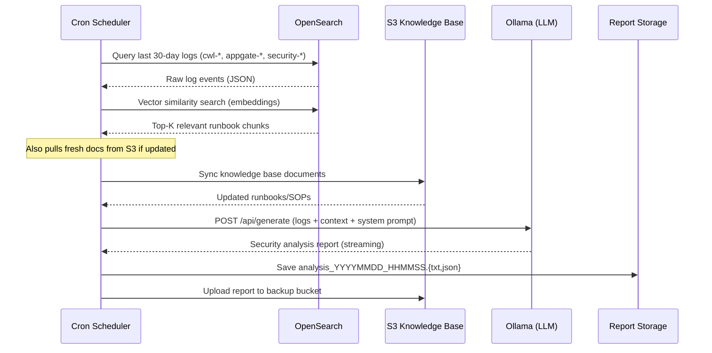
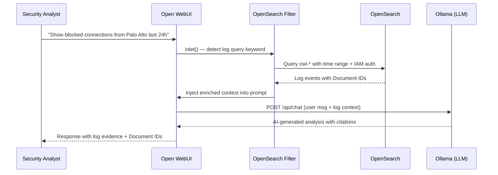

# CNAP AI SIEM Copilot — Architecture

This document describes the system architecture, data flow, and design decisions for the CNAP AI SIEM Copilot.

---

## Component Diagram



---

## Data Flow Diagram

### Automated RAG Analysis (every 30 minutes)



### Real-Time Chat Query (user-initiated)



---

## Security Model

### Zero-Trust Networking

- **No SSH ports open** — all access via AWS SSM Session Manager
- **No public IP** on EC2 instance
- **VPC-private** OpenSearch endpoint only
- **Security Group default-deny** all inbound traffic
- Outbound restricted to: HTTPS (443), OpenSearch, S3, SSM endpoints

### Credential Management

```
❌ NOT used:               ✅ USED:
─────────────────────      ─────────────────────────────────────
Hardcoded passwords        IAM Instance Profile (EC2)
.env with secrets          AWS STS AssumeRole
AWS_ACCESS_KEY_ID          boto3 automatic credential chain
SSH key files              SSM Session Manager
```

### Data Protection

| Layer | Mechanism |
|-------|-----------|
| S3 at rest | AES-256 server-side encryption |
| EBS volume | AES-256 encryption |
| Data in transit | TLS 1.2+ (HTTPS everywhere) |
| OpenSearch | VPC endpoint, IAM auth, TLS |
| Logs | No PII/secrets written to application logs |

### IAM Role Permissions (least privilege)

```json
{
  "OpenSearch": "es:ESHttp*",
  "S3 Knowledge Base": "s3:GetObject, s3:PutObject, s3:ListBucket",
  "S3 Backup": "s3:GetObject, s3:PutObject, s3:ListBucket",
  "CloudWatch Logs": "logs:CreateLogGroup, logs:CreateLogStream, logs:PutLogEvents",
  "SSM": "ssm:GetParameter (read-only, specific prefix)"
}
```

---

## Scalability Considerations

### Horizontal Scaling

The system is designed for single-instance deployment at IL6 GovCloud, but can be scaled:

1. **Multiple RAG Agents**: Run separate agents per log source (Palo Alto, AppGate, Security)
2. **OpenSearch Cluster**: Scale data nodes independently from master nodes
3. **Model Scaling**: Upgrade to llama3.1:70b on a p3.8xlarge for higher quality analysis

### Vertical Scaling

| Instance | GPU | RAM | Inference Speed |
|----------|-----|-----|-----------------|
| t3.xlarge | None | 16GB | ~200 tok/s (CPU) |
| g4dn.xlarge | Tesla T4 16GB | 16GB | ~800 tok/s (GPU) |
| g4dn.2xlarge | Tesla T4 16GB | 32GB | ~800 tok/s (GPU) |
| p3.2xlarge | V100 16GB | 61GB | ~2000 tok/s (GPU) |

### Performance Tuning

- **Ollama**: Set `OLLAMA_NUM_PARALLEL=4` for concurrent requests
- **OpenSearch**: Tune `max_result_window` and shard count for log volume
- **RAG Agent**: Adjust `INTERVAL_MINUTES` (default 30) based on log velocity
- **Embedding Cache**: Pre-computed embeddings stored in OpenSearch avoid re-computation

---

## Cost Breakdown

### Monthly AWS Costs (estimated, us-gov-west-1)

| Resource | Type | Cost/Month |
|----------|------|-----------|
| EC2 (g4dn.xlarge) | On-Demand | ~$526/mo |
| EC2 (t3.xlarge) | On-Demand | ~$120/mo |
| EBS (100GB gp3) | Storage | ~$8/mo |
| S3 Knowledge Base | Storage + requests | ~$5/mo |
| S3 Backup | Storage + requests | ~$10/mo |
| SSM Session Manager | Data transfer | ~$0 |
| **Total (GPU)** | | **~$549/mo** |
| **Total (CPU)** | | **~$143/mo** |

> Use Reserved Instances or Savings Plans to reduce EC2 costs by up to 40%.

---

## Directory Structure

```
cnap-ai-siem-copilot/
├── terraform/          # Infrastructure as Code (AWS resources)
├── docker/             # Docker Compose + service definitions
│   ├── ollama/         # LLM runtime configuration
│   ├── rag-agent/      # Automated analysis Python service
│   ├── open-webui/     # Interactive chat UI + custom filters
│   └── dashboard/      # Report viewer Flask app
├── scripts/            # Operational utilities
├── knowledge-base/     # Sample security runbooks
├── config/             # Shared configuration (prompts, mappings)
└── docs/               # Extended documentation
```
