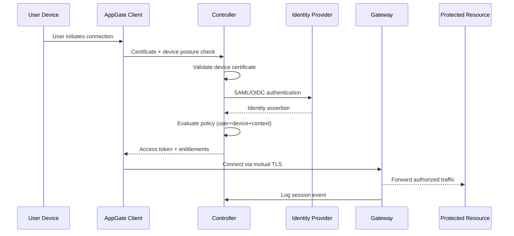

# AppGate SDP — Architecture Guide

**Version:** 3.0  
**Last Updated:** 2024-12  
**Owner:** Identity & Access Management Team  
**Classification:** INTERNAL USE ONLY

---

## Overview

AppGate SDP (Software Defined Perimeter) provides zero-trust network access control for the CNAP environment. This document describes the architecture and how it integrates with the CNAP AI SIEM Copilot.

---

## Architecture Components

```
[User Device] → [AppGate Client] → [Controller] → [Gateway] → [Protected Resources]
                      ↓                  ↓              ↓
                [Certificate]      [Policy Engine]  [Log Export]
                                                        ↓
                                               [OpenSearch: appgate-logs-*]
```

### Key Components

| Component | Purpose | Location |
|-----------|---------|----------|
| AppGate Controller | Policy management and auth | Private subnet |
| AppGate Gateway | Traffic proxy to protected resources | DMZ subnet |
| Certificate Authority | Device/user certificate issuance | Internal PKI |
| SIEM Integration | Log export to OpenSearch | Via syslog/API |

---

## Log Index Structure

AppGate logs are stored in OpenSearch under `appgate-logs-*`.

### Log Types

| Log Type | Field: `type` | Description |
|----------|--------------|-------------|
| Authentication | `auth` | Login success/failure events |
| Authorization | `authz` | Policy enforcement decisions |
| Session | `session` | Session create/teardown |
| Entitlement | `entitlement` | Resource access grants |
| Audit | `audit` | Admin configuration changes |

### Key Fields for SIEM Analysis

```json
{
  "@timestamp": "2024-12-15T12:00:00Z",
  "type": "auth",
  "user": "john.doe@agency.gov",
  "device_id": "device-uuid-here",
  "device_posture_ok": true,
  "source_ip": "10.10.1.50",
  "result": "success|failure|mfa_required",
  "mfa_method": "totp|push|sms",
  "policy_name": "remote-workers-policy",
  "entitlement": "corporate-app-access",
  "risk_score": 0.15,
  "geo_country": "US",
  "session_id": "sess-uuid-here"
}
```

---

## Authentication Flow



---

## Security Policies

### 3.1 Device Posture Requirements

All devices must pass posture checks before access is granted:

| Check | Requirement | Failure Action |
|-------|-------------|---------------|
| OS Patch Level | < 30 days behind | Quarantine VLAN |
| EDR Status | Running and current | Block access |
| Disk Encryption | Required | Block access |
| Screen Lock | Enabled | Warn + allow |
| Certificate | Valid, non-revoked | Block access |

### 3.2 Risk Score Thresholds

| Risk Score | Access Level | Additional Requirements |
|------------|-------------|------------------------|
| 0.0 – 0.3 | Full entitlements | Normal MFA |
| 0.3 – 0.6 | Reduced entitlements | Step-up MFA required |
| 0.6 – 0.8 | Read-only access | Push notification required |
| 0.8 – 1.0 | Blocked | Manual review required |

---

## Responding to AppGate Alerts

### Authentication Failure Spike

**Threshold:** > 10 failures in 5 minutes for a single user

**SIEM Query:**
```
appgate-logs-*: type:auth AND result:failure AND user:"<username>"
```

**Response:**
1. Check if user is aware (travel, new device)
2. Review source IPs — multiple countries = credential stuffing
3. Temporarily suspend account if pattern continues
4. Reset credentials and notify user via alternate channel

### Impossible Travel Detection

**Indicator:** Authentication from two geographic locations > 500km apart within 1 hour

**Response:**
1. Immediately require step-up authentication
2. Review both sessions for malicious activity
3. If confirmed compromise: Revoke all sessions, reset credentials
4. Investigate how credentials were obtained

### Device Certificate Issues

**Indicators:**
- `device_posture_ok: false` with high frequency
- Certificate validation failures

**Response:**
1. Check certificate expiry in PKI system
2. Verify device is domain-joined
3. Re-enroll device if certificate is corrupted
